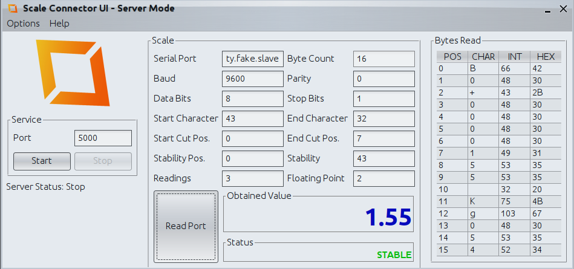

# iDempiere ScaleConnector Plugin

This project is an integration between iDempiere and digital scales with the aim of get the sensor measure from
iDempiere. ScaleConnector can be configured to sync with any device or sensor (temperature, humidity, pressure,
weighing, accountant, etc.)
that communicate through the RS-232 serial port. For mor
info [here](https://wiki.idempiere.org/en/Plugin:_Scale_Connector)

## Dependencies

- Java 11
- iDempiere 8

## Components

### ScaleConnector GUI

#### Development Mode

Add permissions:

```bash
sudo usermod -a -G dialout $(whoami)
```

> Sometimes it's necessary to restart the session after adding new users to a group

Emulating a serial port on linux:

```bash
sudo apt install socat
socat -d -d \
  pty,raw,nonblock,echo=0,iexten=0,link=/tmp/tty.fake.slave \
  pty,raw,nonblock,echo=0,iexten=0,link=/tmp/tty.fake.master
while :; do echo "B0+0000155 Kg054B" > /tmp/tty.fake.master; sleep 0.2; done
```

Running the application:

```bash
./gradlew run
```

Then click on `TCP Server` > `Read Port`.



#### Production Mode

Install the application:

```bash
./gradlew build
sudo unzip -d /opt/ ./scaleconnector-gui/build/distributions/scaleconnector-gui.zip
sudo ln -s /opt/scaleconnector-gui/bin/scaleconnector-gui /usr/local/bin/scaleconnector-gui
```

Check help:

```bash
scaleconnector-gui -h
```

Running on GUI mode:

```bash
scaleconnector-gui gui
```

Running on console TCP server mode:

```bash
scaleconnector-gui server -p 5000
```

Creating a linux service:

```bash
sudo mkdir -p /var/lib/scaleconnector-gui
sudo cp ./scripts/scaleconnector.service /etc/systemd/system/scaleconnector.service
sudo systemctl daemon-reload
sudo systemctl enable scaleconnector
sudo systemctl start scaleconnector
```

## Other useful commands

Check physical serial port:

```bash
setserial -g /dev/ttyS*
```

Check logs for servers:

```bash
tail -f /var/log/syslog | grep scaleconnector
```